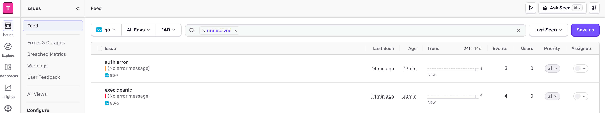

# golang logger
基于uber zap封装而成的logger模块，可用于go应用中记录操作日志和错误日志sentry上报。功能特性如下：
- 支持日志自动切割和最大保留时长
- 支持日志json格式化处理
- 支持日志同时输出到文件和终端
- 支持日志打印级别和日志染色功能
- 支持自定义 zap core 注入，例如：sentry错误上报、openobserve日志平台上报，目前已内置sentry错误上报功能

# logger output and sentry report
```go
package main

import (
	"context"
	"log"
	"os"
	"time"

	"github.com/getsentry/sentry-go"
	"go.uber.org/zap"

	"github.com/daheige/logger"
)

func main() {
	err := sentry.Init(sentry.ClientOptions{
		Dsn: os.Getenv("SENTRY_DSN"),
	})
	if err != nil {
		log.Fatalf("sentry.Init: %v", err)
	}

	defer sentry.Flush(2 * time.Second)
	// mock sentry report capture message
	// sentry.CaptureMessage("It works!")

	logger.Default(
		logger.WithJsonFormat(true),        // 默认json格式化输出
		logger.WithCallerSkip(2),           // 如果基于这个Logger包，需要设置适当的skip
		logger.WithLogLevel(zap.InfoLevel), // 设置日志打印最低级别,如果不设置,默认为info级别
		logger.WithStdout(true),            // 日志默认输出到终端

		logger.WithEnableSentry(true),          // 开启sentry上报
		logger.WithSentryLevel(zap.ErrorLevel), // 只允许错误级别以上的日志上报
	)

	logger.Info(context.Background(), "hello world", "plat", "mac")
	logger.Error(context.Background(), "exec begin", "foo", "abc")
	logger.DPanic(context.Background(), "exec dpanic", "foo", "abc")
	logger.Error(context.Background(), "auth error", "uid", 1)
}
```
sentry上报效果如下：


# zap
https://github.com/uber-go/zap

# sentry
https://sentry.io
